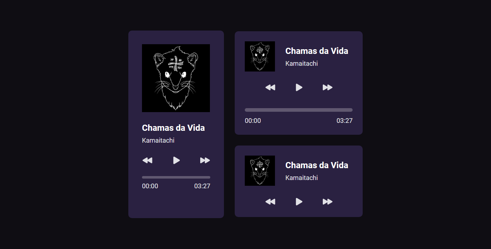

<h1 align="center"> Music Player </h1>

Projeto disponibilizado pela equipe da Rocketseat com intuito de promover layouts para estudo próprio dos participantes. 

  <a href="#-tecnologias">Tecnologias</a>&nbsp;&nbsp;&nbsp;|&nbsp;&nbsp;&nbsp;
  <a href="#-projeto">Projeto</a>&nbsp;&nbsp;&nbsp;|&nbsp;&nbsp;&nbsp;
  <a href="#-layout">Layout</a>

 

  

## 🎓 Tecnologias

Esse projeto foi desenvolvido com as seguintes tecnologias:

- HTML e CSS
- JavaScript 
- Git e Github
- Figma

## 📔 Projeto

Nesse projeto criamos um layout para tocar uma música.

- [Visite o projeto online](https://isaluh.github.io/brcd/player_musica/)

## 🏯 Layout

Visualise o layout do projeto através [desse link](https://www.figma.com/file/rIlj6fBhuQTTUNcxH9CSfR/%23boraCodar---Desafio-1-(Copy)?node-id=0%3A1&t=11yv9PVtWu48V5zD-0). É necessário ter conta no [Figma](https://figma.com) para acessá-lo.

---

<h4 align="center">By: Isaluh 🤍</h4>
